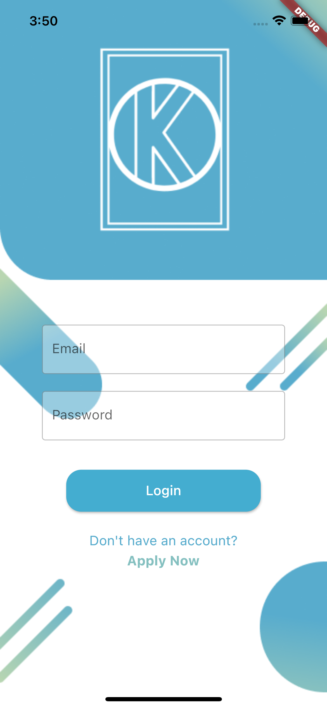

### updating a repo
git add .\
git commit -m "comment"\
git pull "github repo url" master\
git push --force "github repo url"

  
### Merging the repo (when somebody updated the repo) to your local copy

git add .\
git commit -m "comment"\
git fetch\
git merge origin/master

# Overview
Version 1.0

                     

Test 2

      

Test 1

